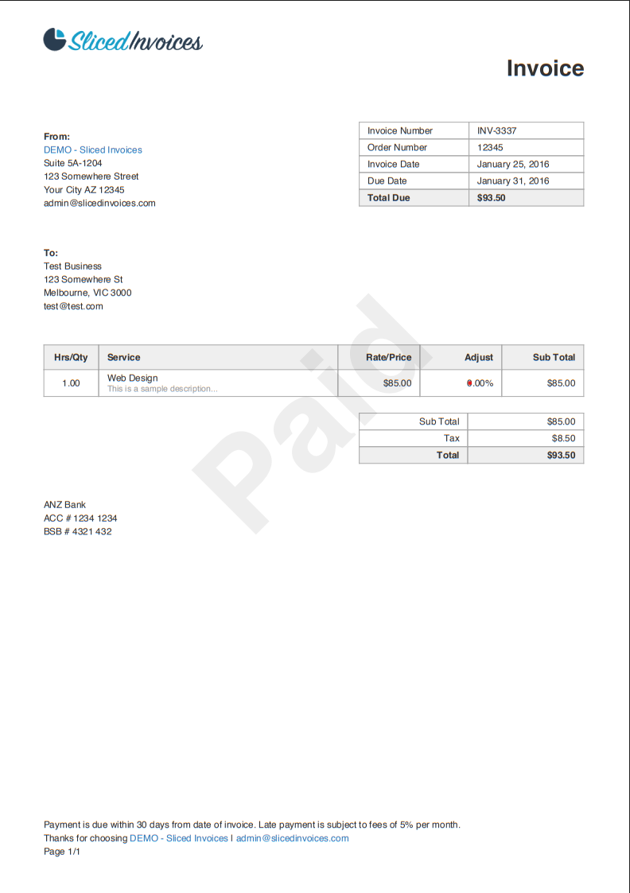

# Amazon Textract Invoice PDF Processor with LLM

This project processes invoice PDFs using **Amazon Textract** and a **Large Language Model (Gemini API)** to extract structured invoice data in JSON format. It also generates a human-readable Markdown report for each invoice.

---

## 📊 Input vs Output Comparison

See the transformation power of AWS Textract combined with LLM processing:

### Original PDF Invoice
**Input**: `invoices/sample_invoice.pdf`


### Markdown Output
**Generated Report**: `markdowns/invoice 03.md`

```markdown
# Document Analysis Report: invoice 03.pdf

*Generated on: 2025-09-06 12:01:07*

## Form Fields


| Field | Value | Confidence |
|-------|-------|------------|
| Rate/Price | $85.00 | 95.3% |
| Page | 1/1 | 94.9% |
| BSB # | 4321 432 | 94.0% |
| Sub Total | $85.00 | 95.2% |
| To: | Test Business 123 Somewhere St Melbourne, VIC 3000 test@test.com | 95.3% |
| ACC # | 1234 1234 | 94.3% |
| Service | Web Design This is a sample description. | 94.5% |
| Hrs/Qty | 1.00 | 95.2% |
| From: | DEMO Sliced Invoices Suite 5A-1204 123 Somewhere Street Your City AZ 12345 admin@slicedinvoices.com | 95.2% |
| Adjust | 0.00% | 95.2% |
| Total | $93.50 | 95.6% |
| Thanks for choosing DEMO - | Sliced Invoices I admin@slicedinvoices.com | 80.0% |
| Tax | $8.50 | 95.6% |
| Invoice Number | INV-3337 | 95.5% |
| Due Date | January 31, 2016 | 95.8% |
| Invoice Date | January 25, 2016 | 95.7% |
| Sub Total | $85.00 | 95.5% |
| Total Due | $93.50 | 95.7% |
| Order Number | 12345 | 95.6% |

## Tables


### Table 1
*Dimensions: 5 rows × 2 columns*
*Confidence: 99.9%*

| Invoice Number | INV-3337 |
|---|---|
| Order Number | 12345 |
| Invoice Date | January 25, 2016 |
| Due Date | January 31, 2016 |
| Total Due | $93.50 |

### Table 2
*Dimensions: 2 rows × 5 columns*
*Confidence: 93.3%*

| Hrs/Qty | Service | Rate/Price | Adjust | Sub Total |
|---|---|---|---|---|
| 1.00 | Web Design This is a sample description. | $85.00 | 0.00% | $85.00 |

### Table 3
*Dimensions: 3 rows × 2 columns*
*Confidence: 95.2%*

| Sub Total | $85.00 |
|---|---|
| Tax | $8.50 |
| Total | $93.50 |

## Document Content

Sliced/nvoices
Invoice
Invoice Number
INV-3337
From:
DEMO Sliced Invoices
Order Number
12345
Suite 5A-1204
Invoice Date
January 25, 2016
123 Somewhere Street
Due Date
January 31, 2016
Your City AZ 12345
Total Due
$93.50
admin@slicedinvoices.com
To:
Test Business
123 Somewhere St
Melbourne, VIC 3000
test@test.com
Hrs/Qty
Service
Rate/Price
Adjust
Sub Total
1.00
Web Design
$85.00
0.00%
$85.00
This is a sample description.
Sub Total
$85.00
Tax
$8.50
Total
$93.50
ANZ Bank
ACC # 1234 1234
BSB # 4321 432
Payment is due within 30 days from date of invoice. Late payment is subject to fees of 5% per month.
Thanks for choosing DEMO - Sliced Invoices I admin@slicedinvoices.com
Page 1/1
```

### Processed JSON Output
**Structured Data**: `pipeline_results/invoice 03.json`

```json
{
    "invoice_number": "INV-3337",
    "invoice_date": "25/01/2016",
    "invoice_total": 93.5,
    "currency": "$",
    "line_items": [
        {
            "description": "Web Design This is a sample description.",
            "quantity": 1.0,
            "unit_price": 85.0,
            "amount": 85.0
        }
    ],
    "payment_terms": "Payment is due within 30 days from date of invoice. Late payment is subject to fees of 5% per month.",
    "extraction_confidence": "high",
    "source_file": "invoice 03.pdf"
}
```

**Key Transformations:**
- 🔄 **PDF Text → Structured Data**: Converts unstructured PDF content into machine-readable JSON
- 📊 **Table Extraction**: Accurately identifies and extracts line item tables
- 💰 **Currency Normalization**: Separates currency symbols and ensures numeric values
- 📅 **Date Standardization**: Converts various date formats to ISO standard
- ✅ **Data Validation**: Ensures mathematical accuracy (line totals, subtotals, tax calculations)

---

## 🚀 Features

- Extracts **form fields** and **tables** from PDF invoices using Amazon Textract
- Converts Textract output into **well-structured Markdown** format
- Uses **Gemini LLM** to extract structured JSON fields:
  - Invoice number
  - Invoice date
  - Line items (description, quantity, unit price, amount)
  - Invoice total
  - Payment terms
  - Currency
- Supports multiple languages and invoice formats
- **Dual Output System**:
  - Markdown reports (`markdowns/`)
  - Structured JSON data (`pipeline_results/`)

---

## 📋 Prerequisites

- Python 3.10 or higher
- AWS Account with Textract access
- Google Gemini API key
- AWS credentials configured (via AWS CLI, IAM roles, or environment variables)

---

## 🛠️ Setup

### 1. Create Conda Environment
```bash
conda create -n invoice-textract-llm-processor python=3.10
conda activate invoice-textract-llm-processor
```

### 2. Clone Repository
```bash
git clone https://github.com/VisalChathuranga/Amazon-Textract-Invoice-PDF-Processor-with-LLM.git
cd Amazon-Textract-Invoice-PDF-Processor-with-LLM
```

### 3. Install Dependencies
```bash
pip install -r requirements.txt
```

### 4. Environment Configuration
Create a `.env` file in the root directory with your API keys:
```env
GEMINI_API_KEY_2=your_gemini_api_key_here
AWS_ACCESS_KEY_ID=your_aws_access_key
AWS_SECRET_ACCESS_KEY=your_aws_secret_key
AWS_DEFAULT_REGION=us-east-1
```

**Note**: Ensure your AWS credentials have permissions for Amazon Textract and S3 services.

---

## 💻 Usage

### Basic Usage
1. Place your invoice PDFs in the `invoices/` folder
2. Run the processor:
```bash
python pipeline_invoicer.py
```
**OR**
```bash
python main.py
```

### Output Locations
The processed results will be automatically saved to:
- **Markdown reports**: `markdowns/`
- **Structured JSON**: `pipeline_results/`

### Example Output Structure
**JSON Output** (`pipeline_results/invoice_001.json`):
```json
{
  "invoice_number": "INV-2024-001",
  "invoice_date": "2024-01-15",
  "currency": "USD",
  "total_amount": 1250.75,
  "line_items": [
    {
      "description": "Professional Services",
      "quantity": 10.0,
      "unit_price": 125.0,
      "amount": 1250.0
    }
  ],
  "payment_terms": "Net 30"
}
```

**Markdown Output** (`markdowns/invoice_001.md`):
```markdown
# Invoice Report: INV-2024-001

## Invoice Details
- **Invoice Number**: INV-2024-001
- **Date**: January 15, 2024
- **Total Amount**: $1,250.75
- **Currency**: USD

## Line Items
| Description | Quantity | Unit Price | Amount |
|-------------|----------|------------|--------|
| Professional Services | 10 | $125.00 | $1,250.00 |
```

---

## 📁 Project Structure

```
amazon_textract_invoice_processor_LLM_pipeline/
│── main.py                        # Entry point
│── pipeline_invoicer.py           # Alternative entry point(Full Code)
│── pipeline_modules/
│   │── config.py                  # Environment variables, constants, folder setup
│   │── logging_config.py          # Logging configuration
│   │── aws_clients.py             # AWS S3 & Textract client setup
│   │── helpers.py                 # Utility functions (date & currency normalization)
│   │── textract_utils.py          # Textract parsing (forms, tables, markdown conversion)
│   │── gemini_utils.py            # Gemini (LLM) JSON extraction logic
│   │── invoice_processor.py       # Main invoice processing pipeline
│── invoices/                      # 📁 Place your PDF invoices here
│── markdowns/                     # 📁 Generated Markdown reports
│── pipeline_results/              # 📁 Extracted JSON files
│── requirements.txt               # Python dependencies
│── .env                           # Environment variables (API keys)
│── README.md                      # This file
```

---

## 📊 Logging

All processing activities are logged to:
```
pipeline.log
```

The logging system captures:
- PDF processing start/completion
- Textract API calls and responses
- Gemini LLM interactions
- Error handling and debugging information
- Performance metrics

---

## ⚙️ Technical Details

### Supported Textract Features
- **TABLES**: Extracts tabular data from invoices
- **FORMS**: Captures form fields and key-value pairs

### Data Processing Pipeline
1. **PDF Upload**: Documents uploaded to S3 for processing
2. **Textract Analysis**: Extract text, forms, and tables
3. **Markdown Conversion**: Convert raw data to readable format
4. **LLM Enhancement**: Use Gemini to structure and validate data
5. **JSON Export**: Generate structured data files
6. **Report Generation**: Create human-readable Markdown reports

### Data Validation
- Ensures numeric values are properly formatted as floats
- Separates currency symbols from amounts
- Validates date formats and converts to ISO standard
- Handles multiple languages and regional formats

---

## 🔧 Configuration Options

### AWS Configuration
Ensure your AWS credentials are configured via one of these methods:
- AWS CLI: `aws configure`
- Environment variables (in `.env` file)
- IAM roles (for EC2/Lambda deployment)

### Gemini API Setup
1. Visit [Google AI Studio](https://makersuite.google.com/app/apikey)
2. Generate your API key
3. Add to `.env` file as `GEMINI_API_KEY_2`

---

## 🚨 Troubleshooting

### Common Issues

**1. AWS Permissions Error**
```bash
Error: Access denied to Textract
```
**Solution**: Ensure your AWS user has `textract:*` and `s3:*` permissions.

**2. Gemini API Error**
```bash
Error: Invalid API key
```
**Solution**: Verify your `GEMINI_API_KEY_2` in the `.env` file.

**3. PDF Processing Failed**
```bash
Error: Unsupported file format
```
**Solution**: Ensure files are valid PDF format and under 10MB.

### Debug Mode
Enable detailed logging by setting environment variable:
```bash
export LOG_LEVEL=DEBUG
```

---

## 📝 Dependencies

Key libraries used in this project:
- `boto3` - AWS SDK for Python
- `google-generativeai` - Gemini API client
- `python-dotenv` - Environment variable management
- `pandas` - Data manipulation
- `json` - JSON processing
- `logging` - Application logging

See `requirements.txt` for complete dependency list.


